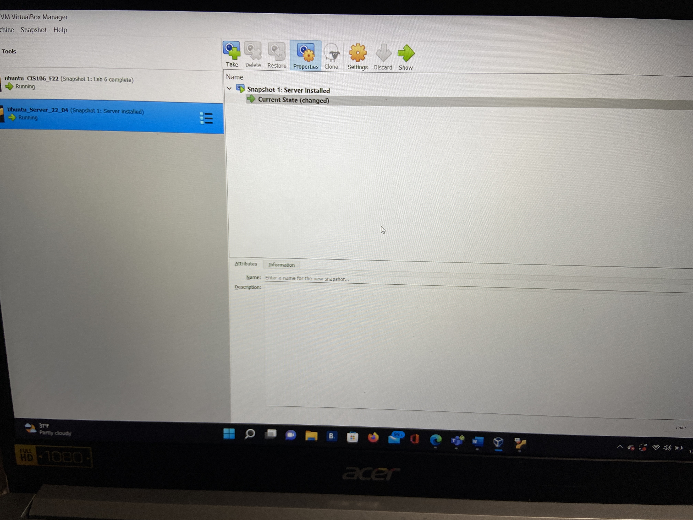
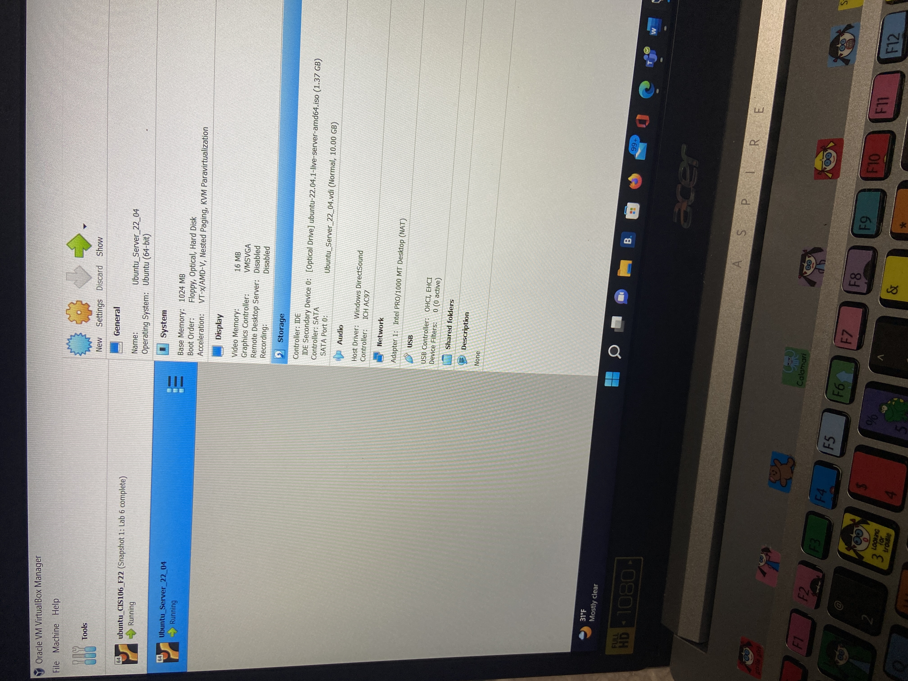
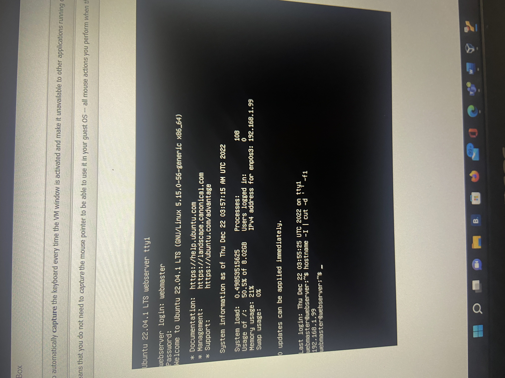
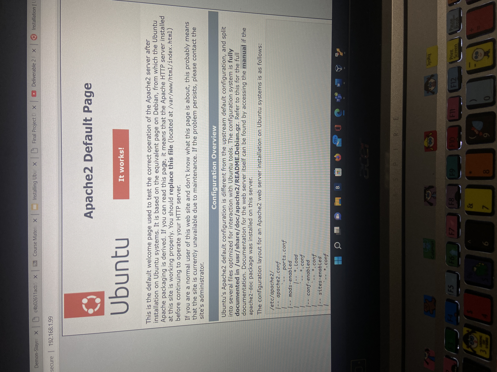
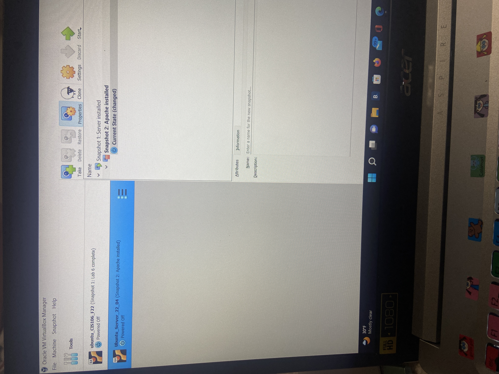

# Deliverable 1 

> Tutorial can be found [here](https://www.digitalocean.com/community/tutorials/how-to-install-the-apache-web-server-on-ubuntu-22-04)

## Concepts I do not understand:

* Apache: the web server that processes requests and serves web assets and content via HTTP
* firewall: a network security device that monitors and filters incoming and outgoing network traffic based on an organization's previously established security policies
* init system: the first process started during booting of the computer system
* systemd: a software suite that provides an array of system components for Linux operating systems
* systemctl: used to examine and control the state of “systemd” system and service manager
* Nginx: open source Web server software that also performs reverse proxy, load balancing, email proxy and HTTP cache services
* Documentroot: top-level directory in the document tree visible from the web and this directive sets the directory in the configuration from which Apache2 or HTTPD looks for and serves web files from the requested URL to the document root
* a2ensite: a script that configures apache2 to enable the provided site which contains a block
* SSL: Secure Sockets Layer, the standard technology for keeping an internet connection secure and safeguarding any sensitive data that is being sent between two systems, preventing criminals from reading and modifying any information transferred, including potential personal details
* virtual hosts: a type of hosting service provider that focuses on virtual infrastructure solutions, including virtual servers, computers, storage and other hybrid platforms that enable the hosting of data, applications and/or services
* LogLevel: a piece of data that indicates the importance of a particular log message

## What is a web server? Hardware and software side

1. On the hardware side, a web server is a computer that stores web server software and a website's component files (for example, HTML documents, images, CSS stylesheets, and JavaScript files). A web server connects to the Internet and supports physical data interchange with other devices connected to the web.
2. On the software side, a web server includes several parts that control how web users access hosted files. At a minimum, this is an HTTP server. An HTTP server is software that understands URLs (web addresses) and HTTP (the protocol your browser uses to view webpages). An HTTP server can be accessed through the domain names of the websites it stores, and it delivers the content of these hosted websites to the end user's device.

* A static web server, or stack, consists of a computer (hardware) with an HTTP server (software). We call it "static" because the server sends its hosted files as-is to your browser
* A dynamic web server consists of a static web server plus extra software, most commonly an application server and a database. We call it "dynamic" because the application server updates the hosted files before sending content to your browser via the HTTP server.

## What are some different web server applications?

### Apache

* Available on all platforms – Linux, Windows, MacOS, and other platforms.
* It’s the default server for all CPanel shared hosting, making it effortless to set up and change sites.
* Tons of functionality offered through a large collection of modules. No matter how obscure your needs be, there’s sure to be an existing module for Apache.
* Per-directory configuration through .htaccess files.
* Support for HTTP/2, compression, static files, and load balancing.
* MPM and FastCGI modes for delivering high concurrency.
* Easy scripting through Lua.

### Nginx

* Asynchronous architecture for handling high loads
* Best-in-the-class static file handling, load balancing, and reverse proxy capabilities.
* FastCGI caching
* Support for uwsgi, SCGI, and other server protocols, with caching.
* Gzipping, image transformation, byte ranges, chunked responses, etc., with FLV and MKV streaming.
* WebSockets, keepalive and pipelined connections
* Access control, error redirection, etc.

### Caddy 

* HTTPS enabled by default. Yes, you don’t need to do anything for installing or renewing SSL certificates.
* HTTP/2 gets primary focus.
* Rotates TLS session ticket keys by default. This makes for a much more secure TLS connection management that is not vulnerable to the likes of Heartbleed.
*No dependencies (it’s a Golang-compiled binary codebase that doesn’t depend on any underlying system libraries)
* Serves static files in the current directory by default!
* Embeddable — can be used as a library in other programs

### Lighttpd

a secure, fast, compliant, and very flexible web server that has been optimized for high-performance environments. lighttpd uses memory and CPU efficiently and has lower resource use than other popular web servers. Its advanced feature-set (FastCGI, CGI, Auth, Output-Compression, URL-Rewriting and much more) make lighttpd the perfect web server for all systems, small and large

* uses minimal CPU, RAM, and other resources
* supports all programming languages
* open-source and free to use

### MonkeyServer

* Targets Linux mainly, but is supported on MacOS as well
* Full support for ARM-based processors
* Works perfectly on Android, Raspberry Pi, and other embedded platforms
* Minimal runtime (100 KB without plugins)
* Supports IPv6 and TLS
* Works with CGI and FastCGI
* Basic authentication, security rules, etc.

### OpenLiteSpeed

* Compatible with Apache’s mod_rewrite, which means if you have a ton of existing Apache files, migrating will be minimal pain.
* Event-driven architecture in the vein of Nginx, resulting in high throughput.
* GUI-based admin interface, offering a pleasant configuration experience.
* Native SAPI for PHP, resulting in higher performance.
* Caching and Google PageSpeedInsights optimizations are applied by default.

### Cherokee

an innovative, feature rich, lightning fast and easy to configure open source web server designed for the next generation of highly concurrent secured web applications

* User friendly, all the configuration is done through Cherokee-Admin, a beautiful and powerful web interface
* supports the most widespread Web technologies: 
  * FastCGI
  * SCGI 
  * PHP
  * uWSGI
  * SSI
  * CGI
  * LDAP
  * TLS/SSL
  * HTTP proxying
  * video streaming
  * content caching
  * traffic shaping
* runs on Linux, Mac OS X, Solaris, and BSD

## What is a virtualization?
relies on software to simulate hardware functionality and create a virtual computer system. This enables IT organizations to run more than one virtual system – and multiple operating systems and applications – on a single server

### Benefits:
* reduces capital and operating costs
* increased IT productivity, efficiency, agility and responsiveness 
* greater business continuity and disaster recovery 
* minimized or eliminated downtime
* faster provisioning of applications and resources
* simplified data center management
  
## What is a virtualbox? 

Oracle VM VirtualBox is cross-platform virtualization software. It allows users to extend their existing computer to run multiple operating systems including Microsoft Windows, Mac OS X, Linux, and Oracle Solaris, at the same time. Designed for IT professionals and developers, Oracle VM VirtualBox is ideal for testing, developing, demonstrating, and deploying solutions across multiple platforms from one machine.

### Critical uses:
* running any operating system
* installing software easily
* ensuring robust redundancy and security 
* developing cross-platform software
* reducing infrastructure costs

## What is a virtual machine?

A virtual computer system is known as a “virtual machine” (VM): a tightly isolated software container with an operating system and application inside.

### Few ways they are used:
* Building and deploying apps to the cloud.
* Trying out a new operating system (OS), including beta releases.
*  Spinning up a new environment to make it simpler and quicker for developers to run dev-test scenarios.
* Backing up your existing OS.
* Accessing virus-infected data or running an old application by installing an older OS.
* Running software or apps on operating systems that they weren't originally intended for.

## What is Ubuntu Server?

part of the larger set of Ubuntu products and operating system developed by Canonical Ltd. Ubuntu server is a specific addition that differs a little bit from Ubuntu desktop, in order to facilitate installation on servers.

> Some of the differences with Ubuntu Server include the replacement of a graphical user interface with a character-based interface for installation, as well as other changes to the interface. These can be customized by the user. The system is compatible with many different platforms like Microsoft Hyper-V and VMware ESX server.

## What is a firewall?
A firewall is a security device — computer hardware or software — that can help protect your network by filtering traffic and blocking outsiders from gaining unauthorized access to the private data on your computer.

### How does it work?
a firewalled system analyzes network traffic based on rules. A firewall only welcomes those incoming connections that it has been configured to accept. It does this by allowing or blocking specific data packets — units of communication you send over digital networks — based on pre-established security rules.

A firewall works like a traffic guard at your computer’s entry point, or port. Only trusted sources, or IP addresses, are allowed in. IP addresses are important because they identify a computer or source, just like your postal address identifies where you live.

### Types of firewalls:
* A hardware firewall is physical, like a broadband router — stored between your network and gateway
* A software firewall is internal — a program on your computer that works through port numbers and applications
* Cloud-based firewalls(FaaS):
  * packet-filtering
  * proxy service
  * stateful multi-layer inspection(SMLI)
  * unified threat management(UTM)
  * next-generation(NGFW)
  
## What is SSH?
SSH, also known as Secure Shell or Secure Socket Shell, is a network protocol that gives users, particularly system administrators, a secure way to access a computer over an unsecured network. It refers to the suite of utilities that implement the SSH protocol. Secure Shell provides strong password authentication and public key authentication, as well as encrypted data communications between two computers connecting over an open network, such as the internet.

### How does SSH work?
Secure Shell was created to replace insecure terminal emulation or login programs, such as Telnet, rlogin (remote login) and rsh (remote shell). SSH enables the same functions -- logging in to and running terminal sessions on remote systems. SSH also replaces file transfer programs, such as File Transfer Protocol (FTP) and rcp (remote copy).

The most basic use of SSH is to connect to a remote host for a terminal session. The form of that command is the following:
> ssh UserName@SSHserver.example.com

### Capabilities:
* secure remote access to SSH-enabled network systems or devices for users, as well as automated processes;
* secure and interactive file transfer sessions;
* automated and secured file transfers;
* secure issuance of commands on remote devices or systems; and
* secure management of network infrastructure components.

# Deliverable 2

Above, I installed the Ubuntu server to get it up and running in order to start the process.

Here I am displaying all the information of the running server.

This displays the login and the software running for the server.

Shows that the ip address changed works on regular server.

Shows the snapshot of apache installed.

