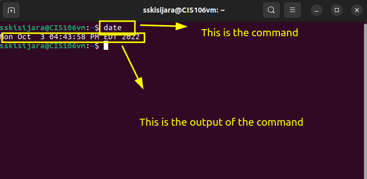
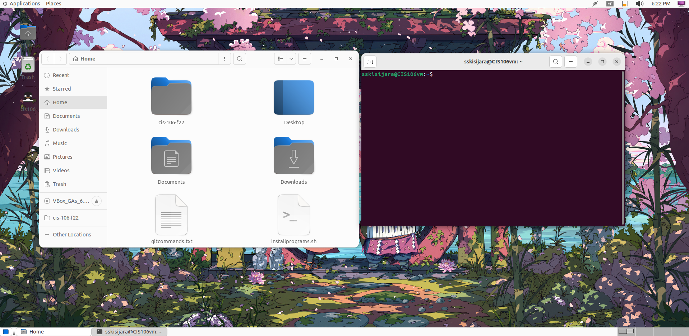

# Lab 3 Submission

## Question 1
Has no submission

## Question 2

## Question 3

| Program purpose     | Package Name     | Version                  |
| ------------------- | ---------------- | ------------------------ |
| Play a tetris game  | blockattack      | 2.7.0.1 amd64            |
| Play a video file   | dragonplayer     | 4:21.12.3-0ubuntu1 amd64 |
| Browse the internet | epiphany-browser | 42.4-0ubuntu1 amd64      |
| Read your email     | getmail6         | 6.18.4-2 all             |
| Play music          | draai            | 20201215-2 all           |

## Challenge 

1. sudo apt install blockattack+ dragonplayer+ epiphany-browser+ getmail6+ draai+
   
2. sudo apt install blockattack- dragonplayer- epiphany-browser- getmail6- draai-
   
3. sudo apt install blockattack+ dragonplayer+ epiphany-browser- getmail6- draai-

## Question 4
| command | what it does                                                   |
| ------- | -------------------------------------------------------------- |
| echo    | display a line of text                                         |
| fortune | print a random, hopefully interesting, adage                   |
| cowsay  | configurable speaking/thinking cow (and a bit more)            |
| lolcat  | rainbow coloring effect for text console display               |
| figlet  | display large characters made up of ordinary screen characters |
| toilet  | display large colourful characters                             |
| rig     | Random Identity Generator                                      |