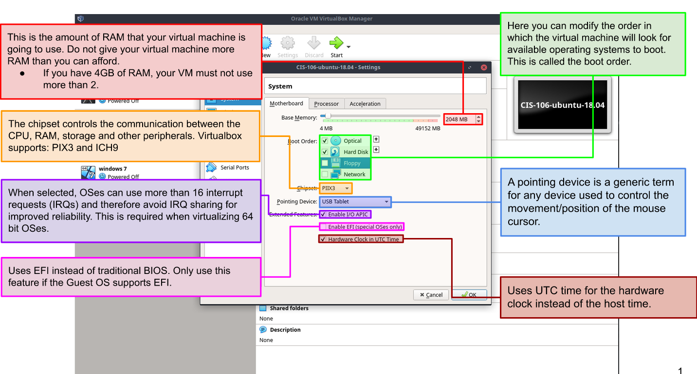

# Week Report 2

## The basics of virtualization 

**What is virtualization?**

Virtualization is replication of hardware to simulate a virtual machine inside a physical machine.

**Types of virtualization**
   
1. Server-side virtualization:
provides a virtual desktop to each user

2. Client-side virtualization:
is a software installed on a computer to manage virtual machines

## Installing Ubuntu in Virtualization 

