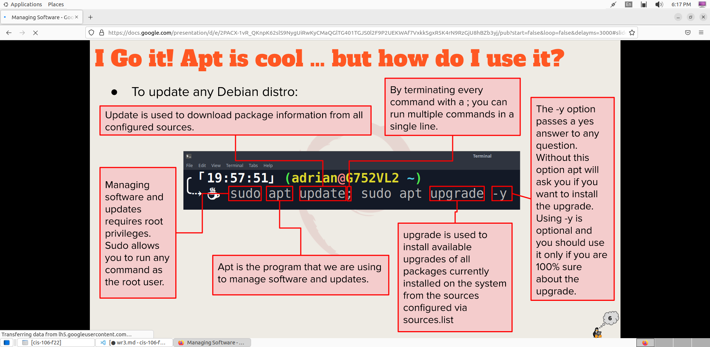

# Week Report 3

## Summary of presentations 

**1. Exploring Desktop Environments**
   
a. List of different desktop environments 

* GNOME
* MATE
* Cinnamon
* Pantheon
* KDE
* BUDGIE
* Openbox
* Deeping DE 
* XFCE
* LXDE
* LXQT
* Fluxbox

b. Definition for the following terms:

* GUI: A graphical user interface is a set of programs that allows a user to interact with the computer system via icons, windows, and various other visual elements. 
* DE: A desktop environment is an implementation of the desktop metaphor made of a bundle of programs running on to of a computer operating system, which shares a common GUI, sometimes describes as a graphical shell. 

c. List of the common elements of a desktop environment 

* Desktop Settings
* Display Manager
* File Manager
* Icons
* Favorite Bar
* Launcher
* Menus
* Panels
* System Tray
* Widgets
  
**2. The Bash Shell**
   
a. What is a shell?

* The GNU bash shell is a program tat provides interactive access to the Linux system.
* It runs as a regular program and is normally started whenever a user logs in into a terminal. 

b. List of different shells

* Tcsh Shell 
* Csh Shell
* Ksh Shell 
* Zsh Shell
* Fish Shell

c. List of some bash shortcuts

* Ctrl+A: go to the start of the command line
* Ctrl+E: go to the end of the command line
* Ctrl+K: delete from cursor to the end of the command line
* Ctrl+U: delete from cursor to the start of the command line
* Ctrl+W: delete from cursor to start of word
* Ctrl+Y: paste word or text that was cut using one of the deletion shortcuts after the cursor
* Ctrl+XX: move between start of command line and current cursor position

d. List of basic commands and their usage

* date: displays the current time and date
* cal: displays a calendar of the current month
* df: displays the current amount of free space on our disk drives 
* free: displays the amount of free memory
* uname: displays information about your system
* clear: clear the screen

**3. Managing Software**

a. Command for updating Ubuntu

sudo + apt + update + Ubuntu

b. Command for installing software

sudo + apt + install + package name

c. Command for removing software

sudo + apt + remove + package name

d. Command for searching for software

sudo + apt + search + "web browser"

e. Definition of the following terms:

* Package: archives that contain binaries of software, configuration files, and information about dependencies.
  
* Library: reusable code that can be used by more than one function or program.
  
* Repository: a large collection of software available for download. 

