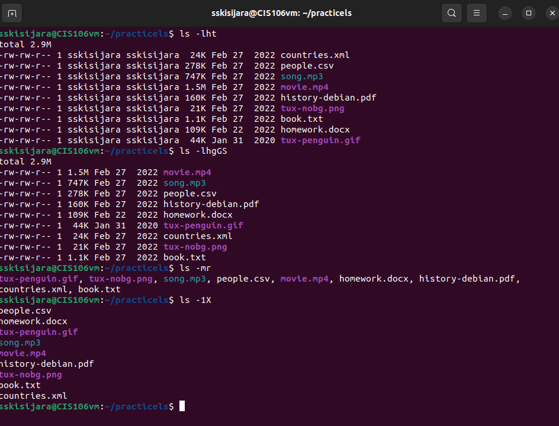

# Week Report 4

1. Practice Exercises
   
a. 

b.  
   

c. 
   

2. 

| Directory | Data Stored in Directory                                                                                                                    |
| --------- | ------------------------------------------------------------------------------------------------------------------------------------------- |
| bin       | essential commands                                                                                                                          |
| dev       | device files                                                                                                                                |
| etc       | system configuration files                                                                                                                  |
| home      | user home directories                                                                                                                       |
| media     | mount point for removable media, such as DVDs and floppy disks                                                                              |
| opt       | add-on software packages                                                                                                                    |
| proc      | kernel information, process control, system hardware information                                                                            |
| srv       | information relating to services that run on the system                                                                                     |
| usr       | software not essential for system operation, such as applications                                                                           |
| var       | dedicated to variable data, such as logs, databases, websites, and temporary spool(email etc.) files that persist from one boot to the next |

| Command | What it does                                                                                                                                          | Syntax           | Example |
| ------- | ----------------------------------------------------------------------------------------------------------------------------------------------------- | ---------------- | ------- |
| pwd     | displays the current working directory                                                                                                                | pwd              | pwd     |
| cd      | changes the current working directory. When no directory is given, cd changes the current working directory to the home directory of the current user | cd + destination | cd ~    |
| ls      | displays all the files inside a given directory. When no directory is specified, ls displays the files in the current working directory               | ls + destination | ls -a   |

1. Definitions of following terms:
   
 * File system: the way files are stored and organized to simplify access to data 
 * Current directory: directory where you are at the moment 
 * Parent directory: moving backwards to the previous directory
 * Difference between **YOUR HOME** directory and **THE HOME** directory:
  1. "your home directory" refers to your user's home directory
  2. "the home directory" refers to the home directory located in the root 
 * Pathname: every file has which indicates the location of the file in the file system
 * Relative path: the location of a file starting from the current working directory or a directory that is located inside the current working directory
 * Absolute path: the location of a file starting at the root of the file system
  
List of all the commands used for navigating the file system

* pwd
* cd
* ls
* tree
* dir
* exa
   
   