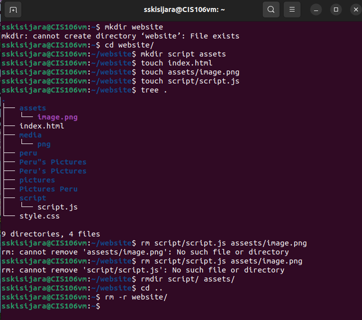
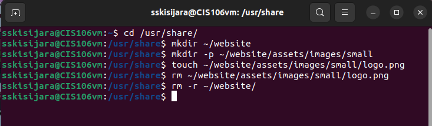
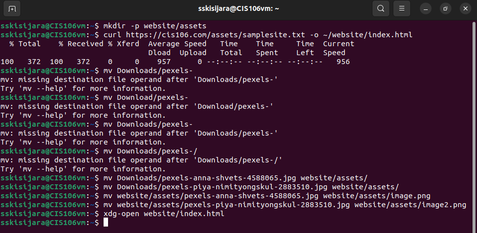
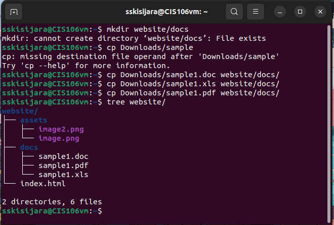

# Week Report 5 

## Answer the following questions:

1. What are Command Options?

Commands are often followed by options that modify/enhance their behavior.

2. What are Command Arguments?

Commands are also followed by arguments which are the items open which the command acts on.

3. Which command is used for creating directories? Provide 3 examples

The command used for creating directories is mkdir. To create a directory use this formula: mkdir + the name of the directory 

**Examples:**
* mkdir wallpapers/'cities usa': creates a directory with a space in the name
* mkdir wallpapers/"majora's mask": creates a directory with a single quote in the name
* mkdir wallpapers/cars wallpapers/cities wallpapers/forest: creates multiple directories

4. What does the touch command do? Provide 3 examples
  
The touch command is used for creating files. 

**Examples:**
* touch list: to create a file called list
* touch list_of_cars.txt script.py names.csv: to create several files
* touch "list of foods.txt": to create a file with a space in its name

5. How do you remove a file? Provide an example

The rm command is used to remove files. 

**Examples:**
* rm -i list: remove a file and prompt confirmation before removal 
* rm -I Downloads/games/*: remove all the files inside a directory and ask before removing more than 3 files
* rm list: remove a file

6. How do you remove a directory and can you remove non-empty directories in Linux? Provide an example

The rm by default does not remove directories. To remove a directory use rm with the -r option. In Linux and other Nix systems you cannot remove non empty directories. To remove empty directories use the rmdir command. To remove non-empty directories use rm -r + directory name ir directory absolute path.  

**Examples:**
* rmdir Downloads/games: remove an empty directory
* rm -r Downloads/games: remove an non-empty directory

7. Explain the mv and cp command. Provide 2 examples of each

mv command moves and renames directories. 
The formula of the mv command is: mv + source + destination
For renaming files/directories the formula is: mv + file/directory to rename + new name

**Examples:**
* mv Downloads/homework.pdf Documents/: to move a file from a directory to another using relative path
* mv games/ wallpapers/ rockmusic/ /media/student/flashdrive/: to move multiple directories/files to a different directory
* mv ~/Downloads/homework.docx ~/Downloads/cis106homework/.docx: to rename a file using absolute path
* mv Downloads/cis106homework.docx Documents/new_cis106homework.docx

cp command copies files/directories from a source to a destination. 
The formula of the cp command is: cp + files to copy + destination
To copy directories use the -r option: cp -r + directory to copy + destination 

**Examples:**
* cp -r ~/Downloads/wallpapers ~/Pictures/: to copy a directory with absolute path
* cp Downloads/wallpapers/* ~/Pictures/: to copy the content of a directory to another directory
* sudo cp -r script.sh program.py home.html assets/ /var/www/html/: to copy multiple files in a single command

## 2. Complete the practices:

* Practice 1
  

  
* Practice 2

* Practice 3
  

  
* Practice 4
  
